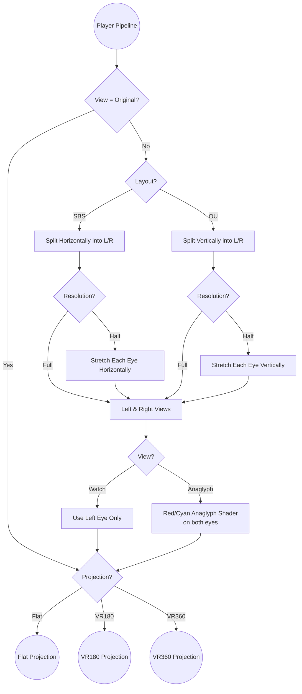

# AI Collaboration Guide for the FlatLens project

This document provides project-specific context and strict behavioral protocols for all AI agents (OpenAI Codex, Gemini CLI, etc.) interacting with this codebase. Adherence to these rules is mandatory.

## Project Overview & Goal

- **Purpose**: **FlatLens** is a cross-platform Electron desktop application that displays 3D video content correctly on standard 2D monitors by correcting distortion.
- **Key Features**: Automatic 3D format detection (SBS/OU) with multiple view modes (Watch, Original, Anaglyph).

## Design Philosophy & Constraints

- **Simplicity**: Minimize user-facing options.
- **Reliability**: Automatic video format detection should be highly accurate.
- **Offline First**: No remote files or network-dependent features.

## Technical Stack

- **Electron**: Core desktop app wrapper; handles the `BrowserWindow` and file system access.
- **Three.js**: Renders the video texture onto 3D geometry in a `<canvas>` using WebGL.
- **Vite**: Dev server and build tool for the renderer process.

## App Architecture

- `index.html`: Main HTML template and CSP. Hosts the `<video>` and `<canvas>`.
- `/css/`: Component-structured styles.
- `/js/main.js`: Renderer entry point; wires DOM to Store; instantiates Controls, Pipeline, Player; sets up cleanup.
- `/js/Store.js`: Global state (single source of truth) via a Repository pattern. Holds app objects, DOM refs, UI state, metadata, and enumerated settings (views, projections, layouts, resolutions).
- `/js/Repository.js`: Minimal reactive store. Immediate-callback subscriptions; boolean toggles and enum cycling.
- `/js/Controls.js`: UI wiring (icons, events, keyboard shortcuts, auto-hide logic). Disables layout/resolution in Original view by design.
- `/js/Player.js`: Thin wrapper over `<video>`; reacts to Store changes; synchronizes time, duration, playback, loop, volume; stops on errors; triggers state updates.
- `/js/Pipeline.js`: Orchestrates the player/rendering pipeline. Subscribes to Store, runs Detector on metadata, configures Render, manages render loop lifecycle and FPS estimation.
- `/js/Detector.js`: Detects layout (SBS/OU), resolution (half/full), and projection (vr180/vr360/flat) via metadata, filename heuristics, and aspect-based inference. Strictly offline.
- `/js/Render.js`: Three.js scene/cameras/materials; flat and VR equirect pipelines; simple red/cyan anaglyph shaders; VR-only pan/zoom with safe clamps; handles convergence, depth tuning, resize, and frame loop.
- `/js/Shaders.js`: Centralized GLSL strings/helpers (equirect mapping, VR edge-feather math, red/cyan anaglyph shaders with luminance-compensated leak filters, convergence, and depth heuristics).
- `/js/Utils.js`: UI and math helpers (icons, timecode, debounce, modifiers, aspect/FOV math, yaw/pitch/FOV clamps).
- `/js/Tooltips.js`: Tippy.js configuration; seekbar tooltip with live time; follows pointer.
- `/js/Icons.js`: Centralized icon metadata for controls (Font Awesome).
- `/js/Debug.js`: Builds the hidden debug panel (toggled with `/`), wires sliders to Store values, and triggers render updates for calibration changes.
- `electron/main.js`: App window creation, dev/prod loading, app menu, global shortcuts, IPC handlers.
- `electron/preload.js`: Exposes safe IPC APIs to the renderer (file-selected, version/meta).

## Renderer Pipeline

FlatLens aims for a "just work" user experience with minimal configuration. Its rendering pipeline uses the following logic:

- Clarifications:
	- Detection Timing: Detector runs once on `loadedmetadata` regardless of view. “Original” view ignores layout/resolution for rendering, but detection still populates Store.
	- Watch View: Monoscopic; samples the left eye only.
	- Anaglyph View: Uses a simple red/cyan shader on both flat and VR equirect pipelines. VR anaglyph considers convergence (±0.01 of half-frame width) and depth heuristics controlled by debug sliders; OU content disables convergence but keeps depth shaping along its vertical axis.

## Debug Calibration Panel

- Hidden behind `Store.debug` and toggled via `/`. Rendered as a `.debug` container appended near the top-left; use only for internal calibration and keep it absent for end users.
- Sliders are defined in `js/Debug.js`, emit 0–1 values, mirror Store state, and trigger `Render.updateMaterial()` plus `requestRender()` so tuning has immediate visual feedback. Values display as percentages for readability (convergence shows ±50% around the midpoint).
- **Filter Red/Green/Blue** (`antiR`, `antiG`, `antiB`):
	- UI range 0–100% maps to 0–50% suppression internally (`value * 0.5`). Red applies to the left eye; green/blue apply to the right eye only.
	- The shader multiplies each channel by `(1 - suppression)` and compensates brightness using channel-specific luminance gains to avoid darkening as leakage decreases.
- **Green Balance** (`balance`):
	- Redistributes up to 50% of the green contribution into the left eye to counter imperfect filter cutoffs. Remaining green stays in the right eye.
- **Eye Convergence** (`convergence`):
	- Slider midpoint (0.5) equals 0%; slider spans −50% to +50% around that midpoint. Shader clamps to ±0.01 of half-frame width for SBS and disables convergence for OU.
- **Depth** (`depth`):
	- Slider shows 0–100% but GLSL multiplies by 0.1. SBS halves compress horizontally (center pixels pushed farther, edges closer); OU halves compress vertically after the layout split so left/right halves remain aligned.

## Detection Model

- Phases: detectLayout → detectResolution → detectProjection. Results update Store (`layout`, `resolution`, `projection`).
- Methods (priority order):
	- Metadata (preferred):
		- Layout: `HTMLVideoElement.videoTracks[i].stereoMode` (left_right/right_left → SBS; top_bottom/bottom_top → OU).
		- Projection (MP4/MOV): parse XMP packet for GSpherical/GPano. ProjectionType must be `equirectangular`. Distinguish VR180 vs VR360 via CroppedArea vs FullPano ratios.
		- Projection (MKV/WebM): EBML scan of initial bytes to locate `Video.ProjectionType` (1 = equirectangular/360).
	- Filename tokens (case-insensitive):
		- Layout: includes SBS keywords (SBS, HSBS, FSBS, Half-SBS, Side-by-Side, 3D.SBS/3D-SBS/SBS3D, etc.) or OU keywords (OU, HOU, FOU, Half-OU, Over-Under, TAB/HTAB, Top-Bottom, T-B).
		- Projection: includes `vr360`/`360` tokens (vr360, 360vr, 360video, 360pano, 3603d, mono360, 360deg, etc.) or `vr180`/`180` tokens (vr180, 1803d, stereo180, pano180, 180deg, etc.).
	- Resolution/Aspect inference:
		- Layout: aspect ≥ 2.8 → SBS; aspect ≤ 1.12 → OU (tolerant heuristics).
		- Resolution: SBS full when aspect ≥ ~3.3; OU full when aspect < 1.0. Otherwise “half”.
	- Default: fall back to current Store values if none of the above methods classify.
- Offline Reads:
	- Only reads from `File/Blob` or `blob:` URLs; never fetches remote content.
	- MP4/MOV XMP: scans the first ~16 MB to locate `<x:xmpmeta>…</x:xmpmeta>`.
	- MKV/WebM EBML: scans the first ~4 MB to find Tracks → TrackEntry → Video → ProjectionType.

## Projection Modes

- Flat: Planar rendering via an orthographic camera to preserve content aspect. Watch and Anaglyph implemented with custom shaders; Original uses basic textured plane.
- VR180: Equirectangular mapping onto an inward-facing sphere segment; perspective camera with default vertical FOV and clamps.
- VR360: Equirectangular mapping onto an inward-facing full sphere; 360° yaw allowed (wraps), pitch clamped.

## Electron Integration

- Dev: Loads from Vite at `http://localhost:5173` and opens dev tools. Production: loads `dist/index.html`.
- IPC:
	- Renderer can read app version/meta via `window.electronAPI.getAppVersion()` and `getAppMeta()`.
	- Main sends `file-selected` when OS “Open with…” or app-level open occurs. Renderer may hook this to set `Store.name`/`file` and derive a `blob:` URL for playback (preferred for CSP/offline consistency).
- Global Shortcuts: F12 toggles dev tools in dev/production.

## Security & Offline

- CSP: Defaults to `self`; scripts and styles allow `'unsafe-inline'` for bundled CSS/JS; `media-src` includes `self`, `blob:`, `data:`; `connect-src` includes localhost WS for dev HMR only.
- Offline Metadata: Detector reads container data from `File/Blob` or `blob:` only. No network fetches for detection or playback content.
- No External Network Dependencies at Runtime: All libraries are bundled locally.

## Development Standards & Conventions

- Indentation: Use tabs.
- Comments: All new functions and classes must have JSDoc comments (describe params, returns, side-effects).
- JavaScript: Use the latest JS features supported by Electron.
- CSS: Follow BEM naming conventions and keep components modular.
- Dependencies: Avoid introducing new external dependencies unless absolutely necessary. If adding, justify size, security, and maintenance implications.

## Performance Notes

- Renderer: `powerPreference: high-performance`, capped device pixel ratio to 2, mips disabled on video texture, linear filtering.
- Resize/Render: Use `debounce` for window resize and render-on-demand when not animating.
- Shaders: Keep branches minimal; reuse materials unless type changes; update uniforms in-place when possible.

## Testing & Validation

- Manual Flows:
	- Load SBS/OU, half/full, and VR180/VR360 samples; verify detection and correct Watch/Original/Anaglyph behavior.
	- Verify pan/zoom clamps (180° yaw clamp vs 360° wrap; pitch limits).
	- Check Original view ignores Layout/Resolution but switches projection correctly.
- Build & Run:
	- npm run dev → web dev
	- npm run e:dev → Electron dev (wait-on + Vite)
	- npm run build / e:build → distributables
- Accessibility:
	- Controls use titles and ARIA labels; ensure tab focus and tooltip behavior remain usable.

## AI Agent Protocols

- Planning:
	- Outline steps briefly; apply minimal, targeted changes; keep scope constrained to requested tasks.
- Code Changes:
	- Use tabs; add JSDoc to any new/modified functions/classes; mirror existing module patterns.
	- Do not introduce new runtime dependencies without strong justification.
	- Respect Offline First: do not add network calls or remote assets.
- Renderer:
	- If modifying detection or render paths, update AGENTS.md and README to match observable behavior.
		- Extending or retuning debug calibration controls (leak filters, balance, convergence, depth) requires synchronized updates to `js/Debug.js`, `js/Shaders.js`, and this document.
- IPC & Electron:
	- When wiring OS file-open, prefer blob URLs (or update CSP explicitly if choosing `file://` sources).
- Validation:
	- Prefer local verification with existing scripts; do not add heavy test frameworks unless asked.
